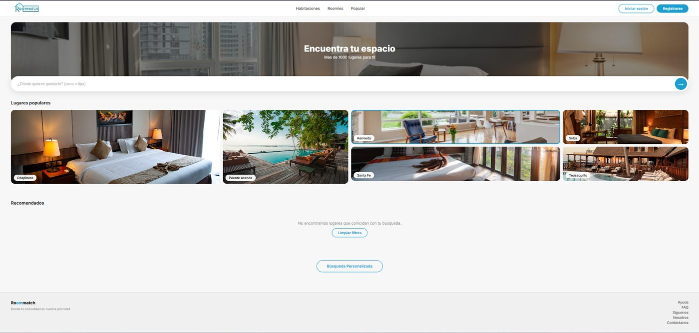
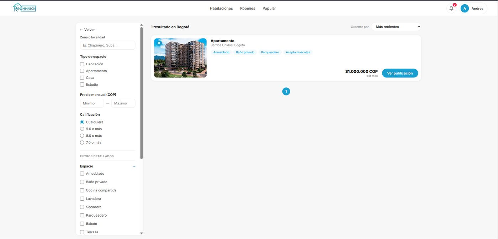
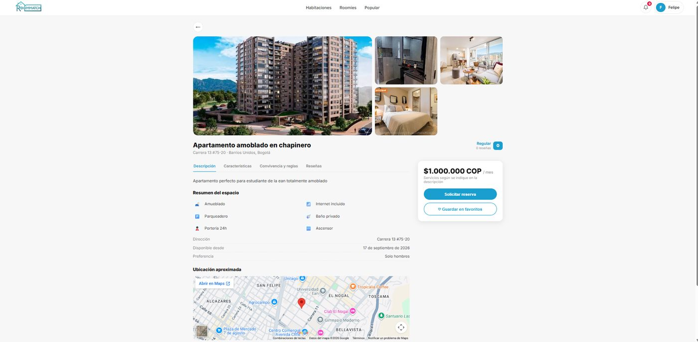
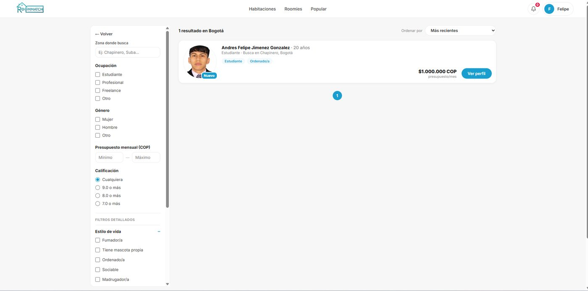
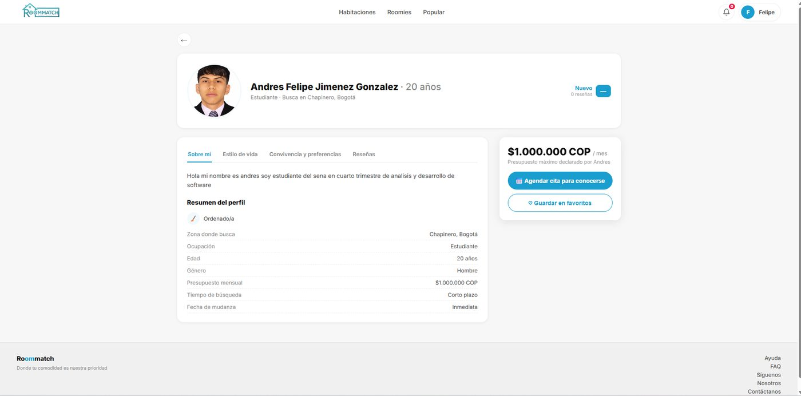
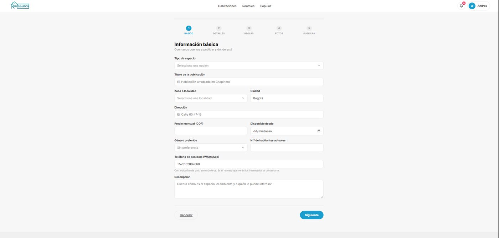
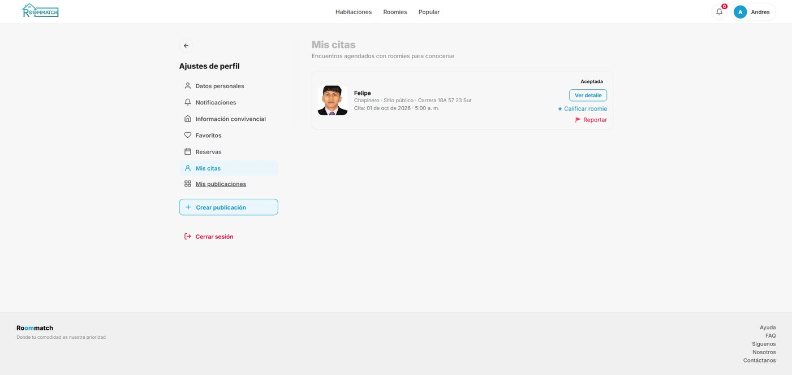
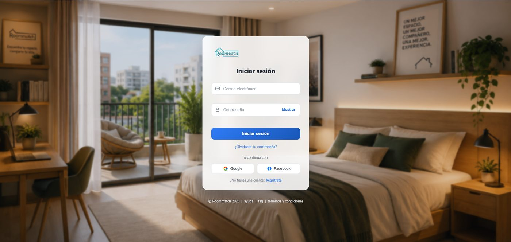
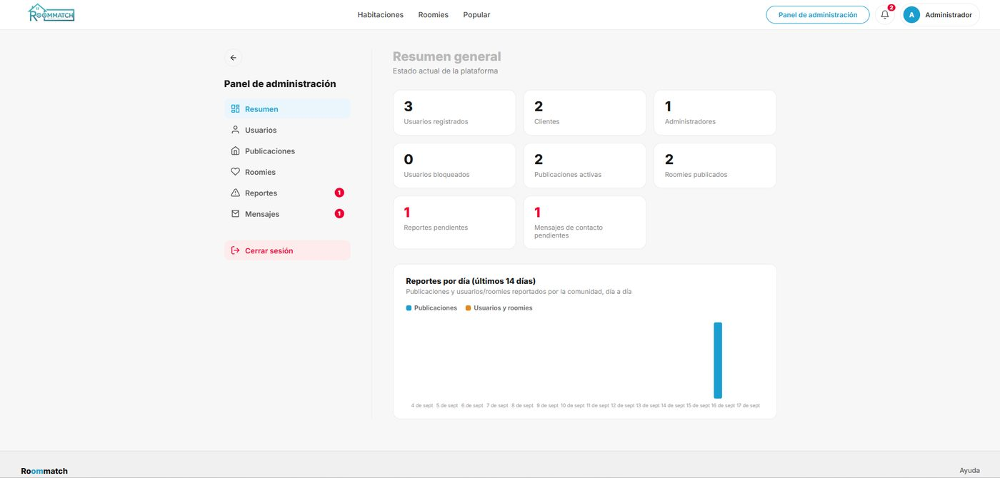
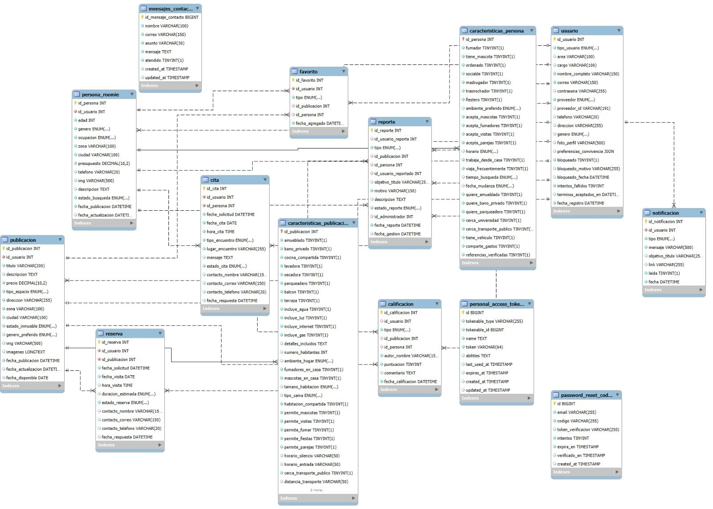

# RoomMatch

Plataforma web en español para conectar personas que buscan un lugar donde vivir con quienes tienen un espacio disponible, y para emparejar personas que buscan **compañero de vivienda (roomie)**. Pensada para Colombia (zonas de Bogotá).

> Proyecto académico desarrollado en equipo en el **SENA** (Tecnólogo en Análisis y Desarrollo de Software).



## ¿Qué permite hacer?

**Para los usuarios (clientes)**
- Registrarse e iniciar sesión (correo y contraseña, o con Google y Facebook).
- Recuperar la contraseña con un código de 6 dígitos enviado por correo.
- Publicar un espacio (habitación, apartamento, casa o estudio) con un asistente de 5 pasos y fotos.
- Buscar espacios con filtros y ver el detalle de cada uno.
- Solicitar una visita (reserva) sobre un espacio.
- Crear un perfil de roomie (asistente de 5 pasos) y agendar citas con otros perfiles.
- Guardar favoritos, calificar espacios y roomies, y reportar contenido.
- Recibir notificaciones y gestionar su perfil, reservas, citas y publicaciones.

**Para los administradores**
- Panel con resumen general de la plataforma.
- Gestión de usuarios (bloquear y desbloquear cuentas) y creación de otros administradores.
- Supervisión de publicaciones y perfiles roomie.
- Revisión de reportes de moderación y mensajes del formulario de contacto.

## Capturas de pantalla

| Habitaciones | Detalle de una publicación |
|---|---|
|  |  |

| Roomies | Perfil de un roomie |
|---|---|
|  |  |

| Crear publicación | Mis citas |
|---|---|
|  |  |

| Inicio de sesión | Panel de administración |
|---|---|
|  |  |

## Tecnologías

- **Backend:** PHP y Laravel (Eloquent ORM, migraciones, FormRequests)
- **API REST** autenticada con **Laravel Sanctum** (tokens)
- **Base de datos:** MySQL (14 tablas: 11 del dominio funcional y 3 técnicas)
- **Frontend:** Blade, HTML, CSS (diseño responsive) y JavaScript
- **Control de versiones:** Git y GitHub
- **Metodología:** Scrum y Kanban

## Base de datos

El modelo relacional incluye usuarios, publicaciones, perfiles roomie, reservas, citas, calificaciones, favoritos, reportes y notificaciones. Las calificaciones, favoritos y reportes son **polimórficos** (pueden apuntar a una publicación, a una persona o a un usuario). Las publicaciones y perfiles roomie usan **borrado lógico** (`deleted_at`).



## Instalación

**Requisitos:** PHP 8.2 o superior, Composer, MySQL.

```bash
# 1. Clonar el repositorio
git clone https://github.com/felipejimenez1806-blip/Roommatch.git
cd Roommatch

# 2. Instalar dependencias
composer install

# 3. Crear el archivo de entorno y generar la clave de la aplicación
cp .env.example .env
php artisan key:generate
```

4. Crea una base de datos vacía en MySQL y configura en `.env` los datos de conexión (`DB_DATABASE`, `DB_USERNAME`, `DB_PASSWORD`). Para el envío de códigos por correo, configura también las variables `MAIL_*`.

```bash
# 5. Crear las tablas
php artisan migrate

# 6. Enlazar la carpeta de imágenes subidas
php artisan storage:link

# 7. Iniciar el servidor
php artisan serve
```

La aplicación quedará disponible en `http://localhost:8000`.

> **Nota:** el administrador principal se crea manualmente en la base de datos o con un seeder. Configura estos datos antes de usar el panel de administración.

## Estructura del proyecto

```
app/Http/Controllers/   Controladores (reservas, roomies, autenticación, etc.)
app/Http/Requests/      Validaciones con FormRequests
app/Models/             Modelos Eloquent
database/migrations/    Migraciones de las 14 tablas
resources/views/        Vistas Blade (layout, navbar, footer)
routes/                 Rutas web y API
public/                 CSS y JavaScript del frontend
```

## Documentación

El proyecto cuenta con documentación técnica: requisitos (IEEE 830), diseño de base de datos, consultas SQL, función y procedimiento almacenados, prototipos de interfaz y diagramas UML (casos de uso, clases, actividades, secuencia, componentes, despliegue y paquetes).

## Equipo

- **Andrés Felipe Jiménez González** – [@felipejimenez1806-blip](https://github.com/felipejimenez1806-blip)
- **Samuel López** – 
- **Diego Gamboa** – 

## Estado del proyecto

En desarrollo. Próximas mejoras: migrar la autenticación a Sanctum SPA (cookies).
